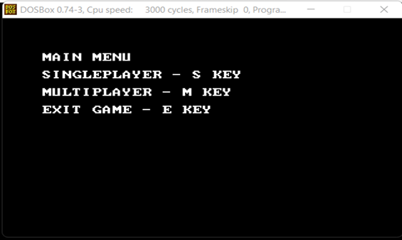
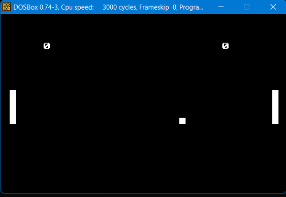
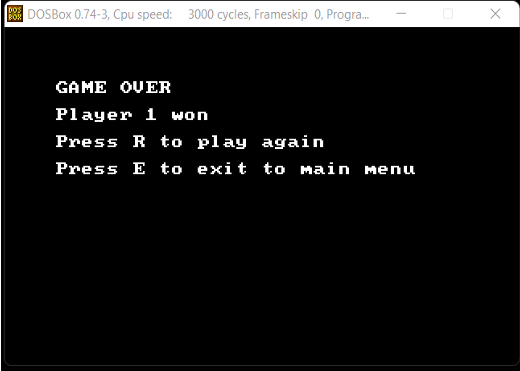

# Pong Game with Assembly Language

This repository contains the source code for a classic Pong game implemented in assembly language for the 8086 processor.

## Screen Shots

      
    
  

## Key Features

-   **Two-Player Mode:** 🎮 Play against a friend using the arrow keys.
-   **Single-Player Mode:** 🕹️ Challenge the AI and test your skills.
-   **Interactive Menu:** Navigate through the menu with options for:
    -   Starting a new game.
    -   Selecting game modes (Single Player/Multiplayer).
    -   Restarting the game.
    -   Exiting the game.
-   **Game Mechanics:** 🏓 Accurate ball physics, realistic paddle movement, and scorekeeping.
-   **Clean and Commented Code:** 📝 Well-structured code with clear comments for better understanding.

## How to Run

-   **Clone:** Clone the repository.
-   **Compile:** Use MASM assembler to compile the assembly code.
-   **Link:** Link the object file using the linker
-   **Run:** Execute the generated executable file in an 8086 emulator like DOSBox.

## Controls

-   **Player 1 (Left Paddle):** 👈 'o' key to move up, 'l' key to move down.
-   **Player 2 (Right Paddle):** 👉 'w' key to move up, 's' key to move down.

## Game Rules

-   The first player to score 5 points wins the game.
-   The ball bounces off the paddles and the top/bottom walls.
-   If the ball hits the left wall, Player 2 scores a point.
-   If the ball hits the right wall, Player 1 scores a point.

**Enjoy the Game!** 🏓
